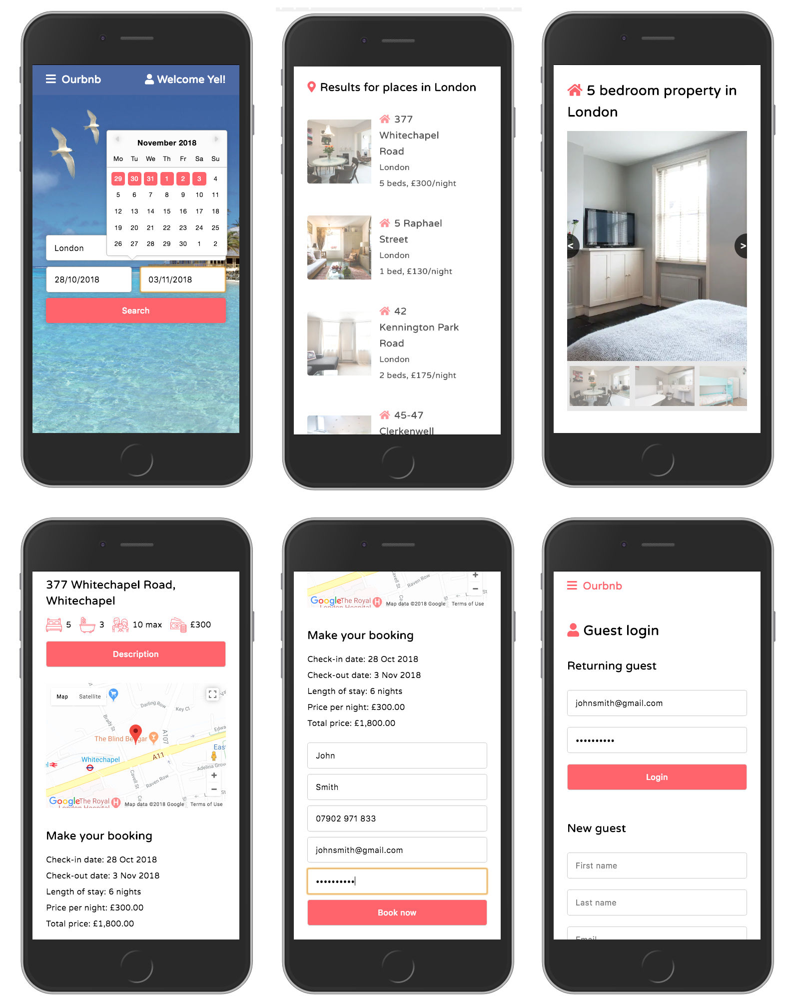
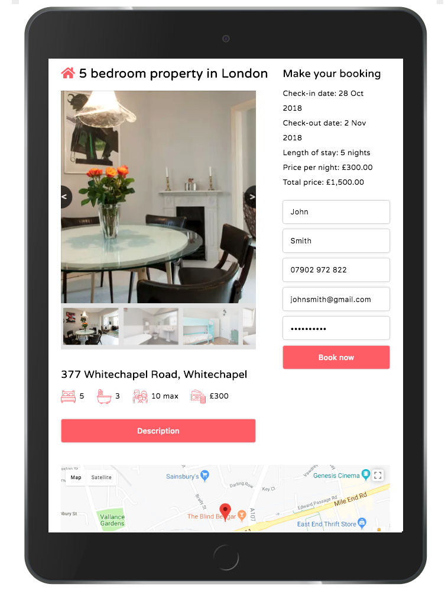

 
 

# Ourbnb app 

## Find and book accommodation
**Ourbnb** allows you to browse, find and book various accommodation in three locations (London, New York and Sydney) based on selected dates. Each property displays a full description with a map and a form to make a booking.  It has a responsive layout for mobile, tablet and desktop screen sizes giving a user-friendly experience.

> [Visit the live demo](#)
> [View the repo on Github](https://github.com/OurBnB/OurBnB)

--- 

## Installation and set up
Clone the project and run `npm install`

Create your own local PostreSQL database instance and create the tables by running `pgweb` navigating to localhost:8081 and running the query in the database.sql file.

Create a `.env` file with the following variables
```
DB_HOST=localhost
DB_NAME=
DB_USERNAME=
DB_PASSWORD=
TWILIO_SID_TEST=
TWILIO_AUTH_TEST=
TWILIO_SID_LIVE=
TWILIO_AUTH_LIVE=
GMAPS_API_KEY=
```
Run `npm start` to launch the app and navigate to localhost:8080

### API Keys needed:
+ Twilio
+ Google Maps

---

### Tech stack
+ React
+ PostgreSQL
+ Node.js
+ Express
+ Handlebars
+ SCSS
+ Classnames
+ Flex-box
+ Grid
+ Git

### Build tools
- Webpack
- Babel

### APIs and Node Packages
+ [Google Maps API](https://developers.google.com/maps/documentation/)- for displaying maps
+ [Twilio API](https://www.twilio.com/docs/libraries/node) - for sending booking confirmation by text
+ [Remark React](https://www.npmjs.com/package/remark-react) - for rendering markdown as HTML
+ [React Date picker](https://www.npmjs.com/package/react-datepicker) - for displaying dates on search screen
+ [React Image Carousel](https://www.npmjs.com/package/react-image-carousel) - for displaying photos of the property's rooms

### Functionality and features
+ The app starts with a quick search based on the user's destination and dates 
+ The app fetches data for relevant properties from the database using SQL
+ The results are displayed as a list using React and SCSS
+ For each property selected, a summary of details, desciption, images and a map for each property are displayed using React and SCSS
+ A booking can then be make by filling out the form
+ You receive a booking confirmation by text with your booking ID
+ You can make further bookings as a guest by setting up a guest account from the main menu

### Stages of development
+ Planned structure of the database tables and their relationships
+ Created database tables, sourced text and image data, entered data into tables
+ Set up and created basic core functionality in React
+ Used SCSS to style the UI
+ Developed and completed functionality for:
> + search page
> + results page
> + property details page
> + login page

### Desired features with more time
+ Wider range of locations to search. Currently limited to London, New York and Sydney
+ Add form validation for email addresses and telephone numbers
+ A map view for search results
+ Allow guests to write reviews of properties
+ Allow hosts to write reviews of guests
+ Allow users to view guest and property reviews
+ Allow users to mark properties as favourites and use localStorage to save the favourites
+ Login for hosts to allow them to 
> + view bookings for their property
> + add new properties to their account
> + communicate with guests