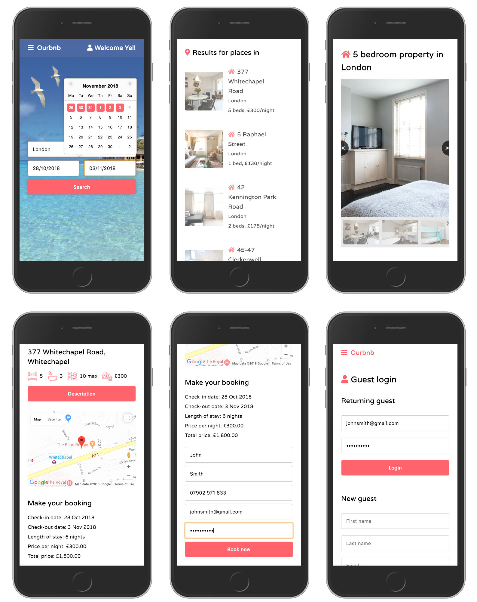

# Ourbnb app > find and book accommodation worldwide

 
 

## Objective > what does it do?
**Ourbnb** is similar to Airbnb, allowing you to find and book accomodation worldwide. It has a responsive layout for mobile, tablet and desktop screen sizes giving a user-friendly experience.

> [View 'Ourbnb' repo on Github](https://github.com/OurBnB/OurBnB)

## Functionality and features > How does it work?
+ The app starts with a quick search based on the user's destination and dates 
+ The app fetches data for relevant properties from the database using SQL
+ The results are displayed as a list using React and SCSS
+ For each property selected, a summary of details, desciption, images and a map for each property are displayed using React and SCSS
+ A booking can then be make by filling out the form
+ You receive a booking confirmation by text with your booking ID
+ You can make further bookings as a guest by setting up a Guest account from the main menu

## Stages of development
+ Planned structure of the database tables and their relationships
+ Created database tables, sourced text and image data, entered data into tables
+ Set up and created basic core functionality in React
+ Used SCSS to style the UI
+ Developed and completed functionality for:
> + search page
> + results page
> + property details page
> + login page

## Technology used
+ SQL
+ Postgres
+ Node.js
+ React
+ SCSS
+ Classnames
+ Flex-box
+ Grid
+ Git

## APIs and Node Packages used
+ Google Maps API - for displaying maps
+ Twilio API - for sending booking confirmation by text
+ Remark React Node package - for rendering markdown as HTML
+ React Datepicker Node package - for displaying dates on search screen
+ React Image Carousel Node package - for displaying photos of the property's rooms

## Problems and errors to be fixed
+ The search is limited to London, New York and Sydney
+ No form validation for email addresses or telephone numbers

## Desired features with more time
+ A map view for search results
+ Allow guests to write reviews of properties
+ Allow hosts to write reviews of guests
+ Allow users to view guest and property reviews
+ Allow users to mark properties as favourites and use localStorage to save the favourites
+ Login for hosts to allow them to 
> + view bookings for their property
> + add new properties to their account
> + communicate with guests
